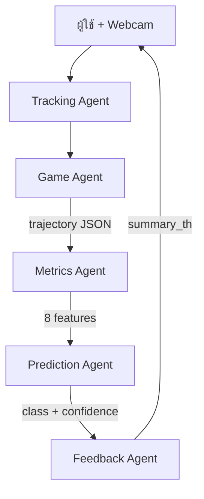

# Agents — Hand Dexterity Assessment

ระบบแบ่งงานเป็น 4 agents ตาม pipeline การประมวลผล



---

## 1. Tracking Agent

**เทคโนโลยี:** MediaPipe Hands (browser)

**หน้าที่:**
- รับภาพจาก webcam
- ตรวจจับมือสูงสุด 2 ข้าง
- ส่งตำแหน่ง landmark index 9 (middle finger MCP)
- แยก Left / Right handedness

**Input:**
- Video stream 640×480

**Output:**
```json
{
  "left": { "x": 0.35, "y": 0.62, "landmarks": [...] },
  "right": { "x": 0.65, "y": 0.58, "landmarks": [...] }
}
```

**ไฟล์:** [`static/js/handTracker.js`](static/js/handTracker.js)

---

## 2. Game Agent

**เทคโนโลยี:** JavaScript (browser)

**หน้าที่:**
- จัด flow เกม: welcome → calibration → trials → result
- สุ่มเป้าหมายสีตามสีที่มือ
- ตรวจ collision มือกับวงเป้าหมาย
- บันทึก trajectory `{t, x, y, hand}` ต่อรอบ
- ส่ง trial data ไป FastAPI

**Input:**
- Hand positions จาก Tracking Agent
- User actions (เริ่ม, หยุด, ดูผล)

**Output:**
```json
{
  "session_id": "uuid",
  "trial_index": 0,
  "target_color": "red",
  "target_x": 320,
  "target_y": 60,
  "hit": true,
  "hit_hand": "Left",
  "reaction_time": 1.2,
  "points": [{ "t": 0.0, "x": 300, "y": 400, "hand": "Left" }]
}
```

**ไฟล์:** [`static/js/game.js`](static/js/game.js), [`static/js/api.js`](static/js/api.js)

---

## 3. Metrics Agent

**เทคโนโลยี:** Python (FastAPI)

**หน้าที่:**
- รับ trial data ทั้ง session
- คำนวณ speed, accuracy, quality แยกมือซ้าย/ขวา
- สรุป success_rate ต่อมือ

**Input:**
- List of `TrialSubmission` objects

**Output:**
```json
{
  "left_scores": { "speed": 0.71, "accuracy": 0.65, "quality": 0.68, "success_rate": 0.75 },
  "right_scores": { "speed": 0.89, "accuracy": 0.91, "quality": 0.87, "success_rate": 0.92 }
}
```

**สูตรหลัก:**
- Speed = f(reaction_time, path_length/duration)
- Accuracy = 1 − (distance/radius) เมื่อ hit ถูกมือ
- Quality = f(jerk) × 0.5 + path_efficiency × 0.5

**ไฟล์:** [`app/metrics.py`](app/metrics.py)

---

## 4. Prediction Agent

**เทคโนโลยี:** scikit-learn RandomForest (local)

**หน้าที่:**
- รับ 8 features จาก Metrics Agent
- ทำนาย class: right_dominant, left_dominant, learned_non_use_left, learned_non_use_right
- คืน confidence score

**Input (8 features):**
```
left_speed, left_accuracy, left_quality, left_success_rate,
right_speed, right_accuracy, right_quality, right_success_rate
```

**Output:**
```json
{
  "prediction": "right_dominant",
  "confidence": 0.82
}
```

**ไฟล์:** [`app/predictor.py`](app/predictor.py), [`app/data/model.joblib`](app/data/model.joblib)

**Training:** [`scripts/train_model.py`](scripts/train_model.py) — synthetic data 2000 samples

---

## 5. Feedback Agent

**เทคโนโลยี:** Template-based (Python)

**หน้าที่:**
- รับ prediction class จาก Prediction Agent
- เลือกข้อความภาษาไทยที่เหมาะสมและ empathetic
- ไม่ใช้ LLM — ใช้ template จาก [`context.md`](context.md)

**Input:**
- prediction class + confidence + hand scores

**Output:**
```json
{
  "summary_th": "มือขวาของคุณเคลื่อนไหวได้คล่อง แม่นยำ และนุ่มนวลกว่ามือซ้าย..."
}
```

**ไฟล์:** [`app/metrics.py`](app/metrics.py) (SUMMARY_TEMPLATES)

---

## Agent Communication Flow

1. **Tracking Agent** ทำงานต่อเนื่อง 30fps ใน browser
2. **Game Agent** บันทึก trajectory ต่อรอบ → POST `/api/session/trial`
3. เมื่อจบ session → POST `/api/session/analyze`
4. **Metrics Agent** ประมวลผลทุก trial
5. **Prediction Agent** ทำนายจาก aggregated features
6. **Feedback Agent** สร้างข้อความสรุป
7. ผลลัพธ์ส่งกลับ browser แสดงหน้า Result

---

## ข้อจำกัดของ Agents

| Agent | ข้อจำกัด |
|-------|----------|
| Tracking | ต้องการแสงดี, มือต้องอยู่ใน frame |
| Game | Demo collision บนหน้าจอ ไม่ใช่ 3D physical |
| Metrics | ต้องมี ≥ 1 trial ที่ hit สำเร็จ |
| Prediction | Train จาก synthetic data — ไม่ validated คลินิก |
| Feedback | Template คงที่ — ไม่ personalize ลึก |
